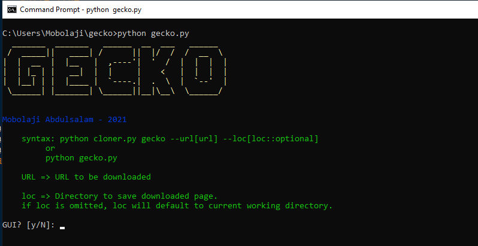

# Gecko-Cloner

[](https://nodesource.com/products/nsolid)

[](https://travis-ci.org/joemccann/dillinger)

Gecko-Cloner is a perfect command line tool for cloning or copying website.

## Installation
You can download the latest tarball by clicking [here](https://github.com/moriire/gecko/archive/refs/tags/1.0.0.tar.gz) or latest zip by clicking [here](https://github.com/moriire/gecko/archive/refs/tags/1.0.0.zip)

Preferably you can download gecko by cloning the Git repository:
```sh
git clone https://github.com/moriire/gecko.git
```
```sh
python setup.py install
```
gecko works out of the box with Python 3.x on any platform.
## Usage
```sh
python gecko.py gecko --url[url: url of page to download] --loc[loc: Location to download page]
```
For interactive cli option:
```sh
python gecko.py 
```
[]
or
For GUI option:
```sh
python gecko.py gui
```
## License
MIT
